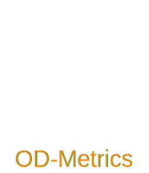

---
hide:
- navigation
---
# Home
<div align="center">
<picture>
  <source media="(prefers-color-scheme: dark)" srcset="assets/logo_dark.svg">
  <source media="(prefers-color-scheme: light)" srcset="assets/logo_light.svg">
  
</picture>
</div>
<p align="center">
  
  
  
  
  <a href="https://github.com/EMalagoli92/OD-Metrics/blob/main/LICENSE">
    
  </a>  
</p>

<p align="center">
  <strong>
    A metrics package for Object Detection.
  </strong>
</p>

## Why OD-Metrics?
- User-friendly
- Customizable
- Fast
- Complete compatibility with [COCOAPI](https://github.com/cocodataset/cocoapi) results

Supported metrics are:

- Mean Average Precision `mAP`
- Mean Average Recall `mAR`
- Intersection over Union`IoU`.


## Installation
Install from PyPI
```
pip install od-metrics
```
Install from Github
```
pip install git+https://github.com/EMalagoli92/OD-Metrics
```


## Usage
### Simple example.
Suppose to be in the following situation. 
!!! Example
    You have `2` images with:

    - `image1`:
        - `2` ground truth bounding boxes, one belonging to `0` class and one to `1` class;
        - `3` predictions bounding boxes, with `labels` `[0, 1, 1]` and `scores` `[.88, .70, .80]`;
    - `image2`:
        - `2` ground truth bounding boxes, each belonging to `0` class;
        - `3` predictions bounding boxes, with `labels` `[0, 1, 0]`, with `scores` `[.71, .54, .74]`.

The `mAP` (Mean Average Precision) and `mAR` (Mean Average Recall)
for the previous situation can be calculated as follows:
``` py title="simple_example"
from od_metrics import ODMetrics

# Ground truths
y_true = [
    { # image 1
     "boxes": [[25, 16, 38, 56], [129, 123, 41, 62]],
     "labels": [0, 1]
     },
    { # image 2
     "boxes": [[123, 11, 43, 55], [38, 132, 59, 45]],
     "labels": [0, 0]
     }
    ]

# Predictions
y_pred = [
    { # image 1
     "boxes": [[25, 17, 37, 54], [119, 111, 40, 67], [124, 9, 49, 67]],
     "labels": [0, 1, 1],
     "scores": [.88, .70, .80]
     },
    { # image 2
     "boxes": [[64, 111, 64, 58], [26, 140, 60, 47], [19, 18, 43, 35]],
     "labels": [0, 1, 0],
     "scores": [.71, .54, .74]
     }
    ]

metrics = ODMetrics()
output = metrics.compute(y_true, y_pred)
print(output)
"""
{'mAP@[.5 | all | 100]': 0.2574257425742574,
 'mAP@[.5:.95 | all | 100]': 0.23168316831683164,
 'mAP@[.5:.95 | large | 100]': -1.0,
 'mAP@[.5:.95 | medium | 100]': 0.23168316831683164,
 'mAP@[.5:.95 | small | 100]': -1.0,
 'mAP@[.75 | all | 100]': 0.2574257425742574,
 'mAR@[.5 | all | 100]': 0.25,
 'mAR@[.5:.95 | all | 100]': 0.225,
 'mAR@[.5:.95 | all | 10]': 0.225,
 'mAR@[.5:.95 | all | 1]': 0.225,
 'mAR@[.5:.95 | large | 100]': -1.0,
 'mAR@[.5:.95 | medium | 100]': 0.225,
 'mAR@[.5:.95 | small | 100]': -1.0,
 'mAR@[.75 | all | 100]': 0.25,
 'classes': [0, 1],
 'n_images': 2}
"""
```


### Custom settings
By default, `ODMetrics` uses `COCO` settings for `iou_thresholds`, `recall_thresholds`,
`max_detection_thresholds` and `area_ranges` (see
[ODMetrics.\__init__()][src.od_metrics.od_metrics.ODMetrics.__init__] method).<br>
Instead of the default `COCO` settings, custom settings can be specified.   
For example, if one is interested in a iou threshold value of `0.4` and a maximum detection
threshold of `2`:

``` py title="custom_settings_example"
from od_metrics import ODMetrics

# Ground truths
y_true = [
    { # image 1
     "boxes": [[25, 16, 38, 56], [129, 123, 41, 62]],
     "labels": [0, 1]
     },
    { # image 2
     "boxes": [[123, 11, 43, 55], [38, 132, 59, 45]],
     "labels": [0, 0]
     }
    ]

# Predictions
y_pred = [
    { # image 1
     "boxes": [[25, 17, 37, 54], [119, 111, 40, 67], [124, 9, 49, 67]],
     "labels": [0, 1, 1],
     "scores": [.88, .70, .80]
     },
    { # image 2
     "boxes": [[64, 111, 64, 58], [26, 140, 60, 47], [19, 18, 43, 35]],
     "labels": [0, 1, 0],
     "scores": [.71, .54, .74]
     }
    ]

metrics = ODMetrics(iou_thresholds=.4, max_detection_thresholds=2)
output = metrics.compute(y_true, y_pred)
print(output)
"""
{'mAP@[.4 | all | 2]': 0.2574257425742574,
 'mAP@[.4 | large | 2]': -1.0,
 'mAP@[.4 | medium | 2]': 0.2574257425742574,
 'mAP@[.4 | small | 2]': -1.0,
 'mAR@[.4 | all | 2]': 0.25,
 'mAR@[.4 | large | 2]': -1.0,
 'mAR@[.4 | medium | 2]': 0.25,
 'mAR@[.4 | small | 2]': -1.0,
 'classes': [0, 1],
 'n_images': 2}
"""
```
### `class_metrics`
The `class_metrics` option enable *per class* metrics: each metric is reported
globally as well for each individual class.
``` py title="class_metrics_example"
from od_metrics import ODMetrics

# Ground truths
y_true = [
    { # image 1
     "boxes": [[25, 16, 38, 56], [129, 123, 41, 62]],
     "labels": [0, 1]
     },
    { # image 2
     "boxes": [[123, 11, 43, 55], [38, 132, 59, 45]],
     "labels": [0, 0]
     }
    ]

# Predictions
y_pred = [
    { # image 1
     "boxes": [[25, 17, 37, 54], [119, 111, 40, 67], [124, 9, 49, 67]],
     "labels": [0, 1, 1],
     "scores": [.88, .70, .80]
     },
    { # image 2
     "boxes": [[64, 111, 64, 58], [26, 140, 60, 47], [19, 18, 43, 35]],
     "labels": [0, 1, 0],
     "scores": [.71, .54, .74]
     }
    ]

metrics = ODMetrics(class_metrics=True)
output = metrics.compute(y_true, y_pred)
print(output)
"""
{'mAP@[.5 | all | 100]': 0.16831683168316827,
 'mAP@[.5:.95 | all | 100]': 0.15148514851485143,
 'mAP@[.5:.95 | large | 100]': -1.0,
 'mAP@[.5:.95 | medium | 100]': 0.15148514851485143,
 'mAP@[.5:.95 | small | 100]': -1.0,
 'mAP@[.75 | all | 100]': 0.16831683168316827,
 'mAR@[.5 | all | 100]': 0.16666666666666666,
 'mAR@[.5:.95 | all | 100]': 0.15,
 'mAR@[.5:.95 | all | 10]': 0.15,
 'mAR@[.5:.95 | all | 1]': 0.15,
 'mAR@[.5:.95 | large | 100]': -1.0,
 'mAR@[.5:.95 | medium | 100]': 0.15,
 'mAR@[.5:.95 | small | 100]': -1.0,
 'mAR@[.75 | all | 100]': 0.16666666666666666,
 'class_metrics': {0: {'AP@[.5 | all | 100]': 0.33663366336633654,
   'AP@[.5:.95 | all | 100]': 0.3029702970297029,
   'AP@[.5:.95 | large | 100]': -1.0,
   'AP@[.5:.95 | medium | 100]': 0.3029702970297029,
   'AP@[.5:.95 | small | 100]': -1.0,
   'AP@[.75 | all | 100]': 0.33663366336633654,
   'AR@[.5 | all | 100]': 0.3333333333333333,
   'AR@[.5:.95 | all | 100]': 0.3,
   'AR@[.5:.95 | all | 10]': 0.3,
   'AR@[.5:.95 | all | 1]': 0.3,
   'AR@[.5:.95 | large | 100]': -1.0,
   'AR@[.5:.95 | medium | 100]': 0.3,
   'AR@[.5:.95 | small | 100]': -1.0,
   'AR@[.75 | all | 100]': 0.3333333333333333},
  1: {'AP@[.5 | all | 100]': 0.0,
   'AP@[.5:.95 | all | 100]': 0.0,
   'AP@[.5:.95 | large | 100]': -1.0,
   'AP@[.5:.95 | medium | 100]': 0.0,
   'AP@[.5:.95 | small | 100]': -1.0,
   'AP@[.75 | all | 100]': 0.0,
   'AR@[.5 | all | 100]': 0.0,
   'AR@[.5:.95 | all | 100]': 0.0,
   'AR@[.5:.95 | all | 10]': 0.0,
   'AR@[.5:.95 | all | 1]': 0.0,
   'AR@[.5:.95 | large | 100]': -1.0,
   'AR@[.5:.95 | medium | 100]': 0.0,
   'AR@[.5:.95 | small | 100]': -1.0,
   'AR@[.75 | all | 100]': 0.0}},
 'classes': [0, 1],
 'n_images': 2}
"""
```
!!! warning
    Enable `class_metrics` has a performance impact.

### `extended_summary`
The `extended_summary` in
[ODMetrics.compute()][src.od_metrics.od_metrics.ODMetrics.compute] method
enable extended summary with additional metrics including `IoU`,
`AP` (Average Precision), `AR` (Average Recall) and `mean_evaluator`
(`Callable`).

``` py title="extended_summary_example"
from od_metrics import ODMetrics

# Ground truths
y_true = [
    { # image 1
     "boxes": [[25, 16, 38, 56], [129, 123, 41, 62]],
     "labels": [0, 1]
     },
    { # image 2
     "boxes": [[123, 11, 43, 55], [38, 132, 59, 45]],
     "labels": [0, 0]
     }
    ]

# Predictions
y_pred = [
    { # image 1
     "boxes": [[25, 17, 37, 54], [119, 111, 40, 67], [124, 9, 49, 67]],
     "labels": [0, 1, 1],
     "scores": [.88, .70, .80]
     },
    { # image 2
     "boxes": [[64, 111, 64, 58], [26, 140, 60, 47], [19, 18, 43, 35]],
     "labels": [0, 1, 0],
     "scores": [.71, .54, .74]
     }
    ]

metrics = ODMetrics()
output = metrics.compute(y_true, y_pred, extended_summary=True)
print(list(output.keys()))
"""
['mAP@[.5 | all | 100]',,
 'mAP@[.5:.95 | all | 100]',
 'mAP@[.5:.95 | large | 100]',
 'mAP@[.5:.95 | medium | 100]',
 'mAP@[.5:.95 | small | 100]',
 'mAP@[.75 | all | 100]',
 'mAR@[.5 | all | 100]',
 'mAR@[.5:.95 | all | 100]',
 'mAR@[.5:.95 | all | 10]',
 'mAR@[.5:.95 | all | 1]',
 'mAR@[.5:.95 | large | 100]',
 'mAR@[.5:.95 | medium | 100]',
 'mAR@[.5:.95 | small | 100]',
 'mAR@[.75 | all | 100]',
 'classes',
 'n_images',
 'AP',
 'AR',
 'IoU',
 'mean_evaluator']
"""
```
In particular `mean_evaluator` is `Callable` that can be used to calculate metrics
for every for each combination of interest between constructor settings that are
not included in default `compute` output.
For example, using standard `COCO` settings, che metric combination 
`mAP@[.75 | medium | 10]` is not included in default `compute` output.

```py title="mean_evaluator_example"
from od_metrics import ODMetrics

# Ground truths
y_true = [
    { # image 1
     "boxes": [[25, 16, 38, 56], [129, 123, 41, 62]],
     "labels": [0, 1]
     },
    { # image 2
     "boxes": [[123, 11, 43, 55], [38, 132, 59, 45]],
     "labels": [0, 0]
     }
    ]

# Predictions
y_pred = [
    { # image 1
     "boxes": [[25, 17, 37, 54], [119, 111, 40, 67], [124, 9, 49, 67]],
     "labels": [0, 1, 1],
     "scores": [.88, .70, .80]
     },
    { # image 2
     "boxes": [[64, 111, 64, 58], [26, 140, 60, 47], [19, 18, 43, 35]],
     "labels": [0, 1, 0],
     "scores": [.71, .54, .74]
     }
    ]

metrics = ODMetrics()
output = metrics.compute(y_true, y_pred, extended_summary=True)
mean_evaluator = output["mean_evaluator"]
_metric = mean_evaluator(
    iou_threshold=.75,
    max_detection_threshold=10,
    area_range_key="medium",
    metrics="AP"
    )
print(_metric)
"""
{mAP@[.75 | medium | 10]': 0.2574257425742574}
"""
```
For all arguments accepted by `mean_evaluator` function, see `extended_summary`
in [ODMetrics.compute()][src.od_metrics.od_metrics.ODMetrics.compute] method.

## API Reference
::: src.od_metrics.od_metrics
    selection:
      docstring_style: numpy

## License

This work is made available under the [MIT License](https://github.com/EMalagoli92/OD-Metrics/blob/main/LICENSE)