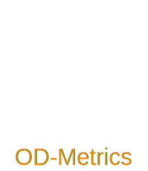

---
hide:
- navigation
---
# OD-Metrics
<div align="center">
<picture>
  <source media="(prefers-color-scheme: dark)" srcset="assets/images/logo_dark.svg">
  <source media="(prefers-color-scheme: light)" srcset="assets/images/logo_light.svg">
  
</picture>
</div>
<p align="center">
  
  
  
  
  <a href="https://codecov.io/gh/EMalagoli92/OD-Metrics">
    </a>
  <br>
  
  <a href="https://github.com/EMalagoli92/OD-Metrics/blob/main/LICENSE">
    </a><br>
  <a href="https://mybinder.org/v2/gh/EMalagoli92/OD-metrics/HEAD?labpath=samples%2Fsamples.ipynb">
    </a>
  <a href="https://colab.research.google.com/github/EMalagoli92/OD-Metrics/blob/main/samples/samples.ipynb">
    </a>
</p>

<p align="center">
  <strong>
    A python library for Object Detection metrics.
  </strong>
</p>


## Why OD-Metrics?
- **User-friendly**: simple to set and simple to use;
- **Highly Customizable**: every parameters that occur in the definition of `mAP`
and `mAR` can be set by user to custom values;
- **Compatibility with [COCOAPI](https://github.com/cocodataset/cocoapi)**: each
calculated metric is tested to coincide with COCOAPI metrics. 


## Supported Metrics
Supported metrics include `mAP` (Mean Average Precision), `mAR` (Mean Average Recall)
and `IoU` (Intersection over Union).


## Installation
Install from PyPI
```
pip install od-metrics
```
Install from Github
```
pip install git+https://github.com/EMalagoli92/OD-Metrics
```

## License

This work is made available under the [MIT License](https://github.com/EMalagoli92/OD-Metrics/blob/main/LICENSE)
