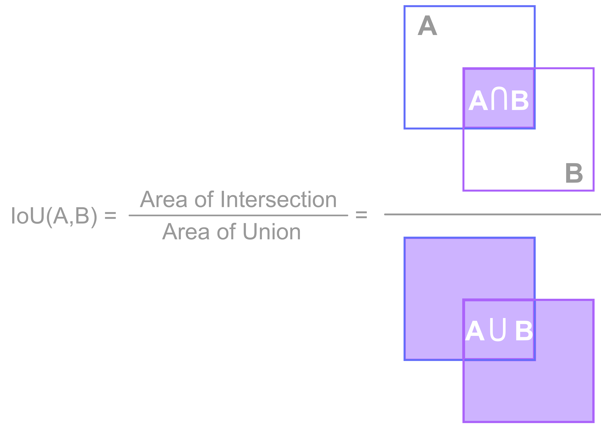
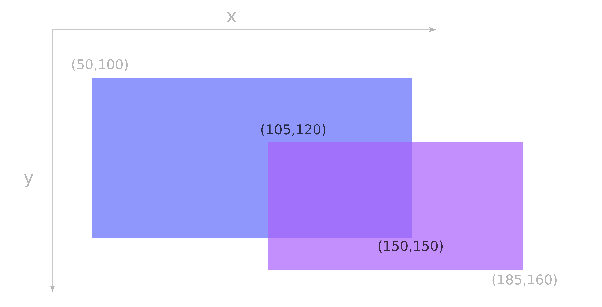

# Intersection over Union (IoU)

<p align="center">
</p>

## What is IoU?
**Intersection Over Union (IoU)** is a widely used metric in computer vision that measures the overlap between two bounding boxes.<br>
**IoU** is a crucial metric in object detection because it provides a clear quantification of how well the bounding boxes predicted by the model match the actual objects in the image.


## Definition
**IoU** (also referred to as the [Jaccard Index](https://en.wikipedia.org/wiki/Jaccard_index)) between two boxes $\textbf{A}, \textbf{B} \in \mathbb{R}^4$ is defined as the ratio of their intersection area to their union area.<br>
Mathematically:

$$\text{IoU}(\textbf{A},\textbf{B})={{|\textbf{A}\cap \textbf{B}|} \over {|\textbf{A}\cup \textbf{B}|}}$$

## How to calculate IoU?
Suppose we need to compute the **IoU** between two boxes $\textbf{A}$ and $\textbf{B}$, given in the `xyxy`(to-left, bottom-right corners) format:

\begin{equation}
\begin{split}
& \textbf{A} = (x^A_1, y^A_1, x^A_2, y^A_2) \\
& \textbf{B} = (x^B_1, y^B_1, x^B_2, y^B_2)
\end{split}
\end{equation}

To compute the intersection between $\textbf{A}$ and $\textbf{B}$ we define:

\begin{equation}
\begin{split}
& x^I_1 = \max(x^A_1, x^B_1)\\
& y^I_1 = \max(y^A_1, y^B_1)\\
& x^I_2 = \min(x^A_2, x^B_2) \\
& y^I_2 = \min(y^A_2, y^B_2) \\
\end{split}
\end{equation}

Then:

$$ |\textbf{A}\cap \textbf{B}| = \max(x^I_2 - x^I_1, 0) * \max(y^I_2 - y^I_1) $$

To calculate the union between $A$ and $B$:

\begin{equation}
\begin{split}
|\textbf{A}\cup \textbf{B}| & = |\textbf{A}| + |\textbf{B}| - |\textbf{A}\cap \textbf{B}|\\
& = |x^A_2 - x^A_1| * |y^A_2 - y^A_1| + |x^B_2 - x^B_1| * |y^B_2 - y^B_1| - |\textbf{A}\cap \textbf{B}|
\end{split}
\end{equation}

### Example
<p align="center">
</p>

\begin{equation}
\begin{split}
& \textbf{A} = (50, 100, 150, 150) \\
& \textbf{B} = (105, 120, 185, 160)
\end{split}
\end{equation}

The intersection is calculated as follows:

\begin{equation}
\begin{split}
& x^I_1 = \max(50, 105) = 105\\
& y^I_1 = \max(100, 120) = 120\\
& x^I_2 = \min(150, 185) = 150 \\
& y^I_2 = \min(150, 160) = 150\\
\end{split}
\end{equation}

Therefore:

$$ |\textbf{A}\cap \textbf{B}| = \max(150 - 105, 0) * \max(150 - 120, 0) = 1350 $$

For the union:

$$ |\textbf{A}\cup \textbf{B}| = |\textbf{A}| + |\textbf{B}| - |\textbf{A}\cap \textbf{B}| = 5000 + 3200 - 1350 = 6850 $$

Then:

$$\text{IoU}(\textbf{A}, \textbf{B}) = \frac{1350}{6850} = 0.19708029$$


## `iscrowd` parameter
OD-Metrics `iou` function supports `iscrowd` [COCOAPI](https://github.com/cocodataset/cocoapi) parameter, which indicates whether a ground truth bounding box $\textbf{y}_{true}$ represents a crowd of objects. For `crowd` regions, the **IoU** metric is computed using a modified criterion: if a $\textbf{y}_{true}$ object is marked as `iscrowd`, it is permissible for a detected object $\textbf{y}_{pred}$ to match any subregion of the $\textbf{y}_{true}$. Choosing $\textbf{y}'_{true}$ in the crowd $\textbf{y}_{true}$ that best matches the $\textbf{y}_{pred}$ can be done using:

$$\textbf{y}'_{true} = \textbf{y}_{pred} \bigcap \textbf{y}_{true}$$

Since by definition:

$$ \textbf{y}'_{true} \bigcup \textbf{y}_{pred} = \textbf{y}_{pred}$$

computing **IoU** when `iscrowd=True`, is equivalent to:

\begin{equation}
\begin{split}
\text{IoU}(\textbf{y}_{true}, \textbf{y}_{pred}) & = \text{IoU}(\textbf{y}'_{true}, \textbf{y}_{pred}) 
       \\ & = \frac{|\textbf{y}_{true} \bigcap \textbf{y}_{pred}|}{\textbf{y}_{pred}}
\end{split}
\end{equation}

This modified **IoU** criterion is applied to `crowd` regions in the ground truth.


## IoU in OD-Metrics
OD-Metrics supports **IoU** metrics with the `iou` function. The usage is straightfoward.
```python
from od_metrics import iou

a = [[50, 100, 150, 150]]
b = [[105, 120, 185, 160]]

result = iou(a, b, box_format="xyxy")
print(result)
"""
array([[0.19708029]])
"""
```

For more examples see [Usage](usage.md#iou) or [API Reference](api_reference.md).
