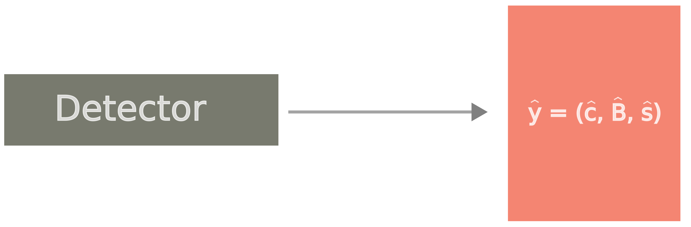

# Mean Average Precision (mAP) and Recall (mAR)

## What is mAP?
**Mean Average Precision (mAP)** is the de facto standard accuracy metric in object detection, providing a comprehensive measure of a model's ability to correctly detect and localize objects within an image. 
This description and methodology follow the approach detailed in R. Padilla *et al.* [@electronics10030279].

## How to calculate mAP?
The calculation of **mAP** involves the **Predictions** generated by the object detector and the corresponding **Ground-truth** annotations.

### Predictions
Each prediction of an object detector consists of the following components:

- **Class** $\hat{c} \in \mathbb{N}_{\leq C}^+$, where $C \in \mathbb{N}^+$ is the total number of classes;
- **Bounding Box** $\hat{\textbf{B}} \in \mathbb{R}^4$, specifying the location of the detected object;
- **Confidence Score** $\hat{s} \in [0, 1]$, indicating the model's confidence in the prediction.

Each detection can be represented as:

$$ \hat{\textbf{y}} = ( \hat{c}, \hat{\textbf{B}}, \hat{s} ) $$

### Ground-truth
Ground-truth annotations provide the reference data against which predictions are evaluated. Each ground-truth annotation consists of the following components:

- **Class** $c \in \mathbb{N}_{\leq C}^+$, the true class label of the object;
- **Bounding Box** $\textbf{B} \in \mathbb{R}^4$, the true location of the object.

Each ground-truth object can be represented as:

$$\textbf{y} = ( c, \textbf{B} ). $$

To compute **mAP**, the following sets are used:

- a set of $G$ ground-truth objects:

$$Y = \{\textbf{y}_i=(c_i, \textbf{B}_i) \}_{i=1,\ldots,G} $$

- a set of $D$ predictions:

$$\hat{Y} = \{\hat{\textbf{y}}_j = (\hat{c}_j, \hat{\textbf{B}}_j, \hat{s}_j) \}_{j=1,\ldots,D} $$

### Precision and Recall
To compute **Precision ($\text{P}_\bar{c}$)** and **Recall ($\text{R}_\bar{c}$)** for a fixed class $\bar{c} \in \mathbb{N}_{\leq C}^+$, let's define **True Positives ($\text{TP}_\bar{c}$)**, that are predictions $\hat{\textbf{y}} = ( \hat{c}, \hat{\textbf{B}}, \hat{s} )$ that meet the following criteria:

- the predicted class matches the ground-truth class ($\hat{c} = \bar{c}$);
- the **IoU** between the predicted and ground-truth bounding boxes is greater than or equal to a IoU threshold $\tau_{\text{IoU}}$ ($\text{IoU}( \textbf{B}, \hat{\textbf{B}} ) \geq \tau_{\text{IoU}}$);
- the confidence score $\hat{s}$ is greater than or equal to a confidence threshold $\tau_{s} (\hat{s} \geq \tau_{s})$. 

Formally, the definition of $\text{TP}_\bar{c}$ (depending on $\tau_{\text{IoU}}$ and $\tau_{s}$):

$$\text{TP}_{\bar{c}}(\tau_{s}; \tau_{\text{IoU}}) = \{ ( \hat{c}, \hat{\textbf{B}}, \hat{s} ) \in \hat{Y} \mid \exists \; ( \bar{c}, \textbf{B} ) \in Y: \hat{c} = \bar{c} \wedge \text{IoU}( \textbf{B}, \hat{\textbf{B}} ) \geq \tau_{\text{IoU}} \wedge \hat{s} \geq \tau_{s} \}. $$

Thus, we can define **Precision ($\text{P}_\bar{c}$)** as:

$$ \text{P}_{\bar{c}}(\tau_{s}; \tau_{\text{IoU}}) = \frac{\text{TP}_{\bar{c}}(\tau_{s}; \tau_{\text{IoU}})}{\text{TP}_{\bar{c}}(\tau_{s}; \tau_{\text{IoU}}) + \text{FP}_{\bar{c}}(\tau_{s}; \tau_{\text{IoU}})} = \frac{|\text{TP}_{\bar{c}}(\tau_{s}; \tau_{\text{IoU}})|}{|\hat{Y}_{\bar{c}, \tau_{s}}|}$$

where $\hat{Y}_{\bar{c}, \tau_{s}} = \{\hat{y} = ( \hat{c}, \hat{\textbf{B}}, \hat{s} ) \in \hat{Y} \mid \hat{c} = \bar{c} \wedge \hat{s} \geq \tau_{s}\}$.

Similarly for the **Recall ($\text{R}_\bar{c}$)**:

$$ \text{R}_{\bar{c}}(\tau_{s}; \tau_{\text{IoU}}) = \frac{\text{TP}_{\bar{c}}(\tau_{s}; \tau_{\text{IoU}})}{\text{TP}_{\bar{c}}(\tau_{s}; \tau_{\text{IoU}}) + \text{FN}_{\bar{c}}(\tau_{s}; \tau_{\text{IoU}})} = \frac{|\text{TP}_{\bar{c}}(\tau_{s}; \tau_{\text{IoU}})|}{|Y_{\bar{c}}|}$$

where $Y_{\bar{c}} = \{ y = (c, \textbf{B}) \in Y \mid c = \bar{c} \}$.

### Average Precision
For a specific class $\bar{c}$ and a fixed IoU threhsold $\bar{\tau}_{IoU}$, the **Average Precision** $\text{AP}_{\bar{c}}@[\bar{\tau}_{IoU}]$ is a metric based on the area under a $\text{P}_{\bar{c}}(\tau_{s}; \bar{\tau}_{\text{IoU}})\times \text{R}_{\bar{c}}(\tau_{s}; \bar{\tau}_{\text{IoU}})$ curve:

$$\text{AP}_{\bar{c}}@[\bar{\tau}_{\text{IoU}}] = \int_0^1 \text{P}_{\bar{c}}(\text{R}_{\bar{c}}; \bar{\tau}_{\text{IoU}}) d\text{R}_{\bar{c}} $$

This area is in practice replaced with a finite sum using certain recall values and different interpolation methods.
One starts by ordering the $K$ different confidence scores output by the detector, for the specific class $\bar{c}$:

$$\{ \tau_{s_k}, k \in \mathbb{N}_{\leq K}^+ \mid \tau_{s_i} > \tau_{s_j} \; \forall i > j\}$$

Since the $\text{R}_{\bar{c}}$ values have a one-to-one, monotonic correspondence with $\tau_{s_k}$, which has a one-to-one, monotonic, correspondence with the index $k$, then the Precision-Recall curve is not continuous but sampled at the discrete points $\text{R}_{\bar{c}}(\tau_{s_k};\bar{\tau}_{\text{IoU}})$, leading to the set of pairs $(\text{P}_{\bar{c}}(\tau_{s_k};\bar{\tau}_{\text{IoU}}),\text{R}_{\bar{c}}(\tau_{s_k};\bar{\tau}_{\text{IoU}}))$ indexed by $k$.
Now one defines an ordered set of reference recall values $\text{R}_r$:

$$\{ \text{R}_{r_n}, n \in \mathbb{N}_{\leq N}^+ \mid \text{R}_{r_m} < \text{R}_{r_n} \; \forall m > n \}$$

The **Average Precision** $\text{AP}_{\bar{c}}$ is computed using the two ordered sets $\{ \tau_{s_k} \}_{k \in \mathbb{N}_{\leq K}^+}$ and $\{ \text{R}_{r_n} \}_{n \in \mathbb{N}_{\leq N}^+}$. But before computing $\text{AP}_{\bar{c}}$, the Precision-Recall pairs have to be interpolated such that the resulting Precision-Recall curve is monotonic. The resulting interpolated curve is defined by a continuous function $\tilde{\text{P}}_{\bar{c}}(x; \bar{\tau}_{\text{IoU}})$, where $x$ is a real value contained in the interval $[0, 1]$, defined as:

$$\tilde{\text{P}}_{\bar{c}}(x; \bar{\tau}_{\text{IoU}}) = \max_{k \in \mathbb{N}_{\leq K}^+ \mid \text{R}_{\bar{c}}(\tau_{s_k}, \bar{\tau}_{\text{IoU}}) \geq x} \text{P}_{\bar{c}}(\tau_{s_k}; \bar{\tau}_{\text{IoU}})$$

The precision value interpolated at recall $x$ corresponds to the maximum precision $\text{P}_{\bar{c}}(\tau_{s_k}; \bar{\tau}_{\text{IoU}})$ whose corresponding recall value is greater than or equal to $x$.

### N-Point Interpolation
In the **$N$-point interpolation**, the set of reference recall values $\{ \text{R}_{r_n} \}_{n \in \mathbb{N}_{\leq N}^+}$ are equally spaced in the interval $[0, 1]$ that is:

$$\text{R}_{r_n} = \frac{N - n}{N -1}, \; \; n \in \mathbb{N}^+_{\leq N}$$

and:

$$ \text{AP}_{\bar{c}}@[\bar{\tau}_{\text{IoU}}] = \frac{1}{N} \sum_{n=1}^N  \tilde{\text{P}}_{\bar{c}}(\frac{N - n}{N -1}; \bar{\tau}_{\text{IoU}}) $$

Popular choices include $N=101$ as in [MS-COCO](https://cocodataset.org/#home) [@lin2014microsoft] detection competition, and $N=11$, initially adopted by the [PASCAL-VOC](http://host.robots.ox.ac.uk/pascal/VOC/index.html) [@everingham2015pascal, @everingham10], which later transitioned to the all-point interpolation method.

!!! hint "`OD-Metrics`"
    Since `OD-Metrics` adopts the [MS-COCO](https://cocodataset.org/#home) [@lin2014microsoft] standard, it uses the **$N$-point interpolation**.

### All-Point Interpolation
In the so-called **all-point interpolation**, the set values $\{ \text{R}_{r_n} \}_{n \in \mathbb{N}_{\leq N}^+}$ corresponds exactly to the set of recall values computed considering all $K$ confidence levels $\{ \tau_{s_k} \}_{k \in \mathbb{N}_{\leq K}^+}$:

$$ \text{AP}_{\bar{c}}@[\bar{\tau}_{\text{IoU}}] = \sum_{k=0}^{K} (\text{R}_\bar{c}(\tau_{s_k}; \bar{\tau}_{\text{IoU}}) - \text{R}_\bar{c}(\tau_{s_{k+1}}; \bar{\tau}_{\text{IoU}})) \tilde{\text{P}}_{\bar{c}}(\text{R}_\bar{c}(\tau_{s_k}; \bar{\tau}_{\text{IoU}}); \bar{\tau}_{\text{IoU}}) $$

with $\tau_{s_0} = 0$, $\text{R}_\bar{c}(\tau_{s_0}; \bar{\tau}_{\text{IoU}}) = 1$, $\tau_{s_{K+1}} = 1$, $\text{R}_\bar{c}(\tau_{s_{K+1}}; \bar{\tau}_{\text{IoU}}) = 0$.

### Mean Average Precision
Regardless of the interpolation method, the **Average Precision** $\text{AP}_{\bar{c}}@[\bar{\tau}_{IoU}]$ is obtained individually for each class $\bar{c}$. In large datasets, it is useful to have a unique metric value that is able to represent the accuracy of the detections among all $C$ classes. For such cases, the **Mean Average Precision** $\text{mAP}@[\bar{\tau}_{\text{IoU}}]$ is computed, which is simply:

$$\text{mAP}@[\bar{\tau}_{\text{IoU}}] = \frac{1}{C}\sum_{c=1}^C \text{AP}_{c}@[\bar{\tau}_{\text{IoU}}] $$

In certain competitions, the final metric $\text{mAP}@[T]$ is computed as the average over a predefined set $T$ of IoU thresholds $\tau_{\text{IoU}}$. For instance, in [MS-COCO](https://cocodataset.org/#home) [@lin2014microsoft], $T$ is defined as $\{0.5, 0.55, \ldots, 0.95\}$ (increments of 0.05) and it is commonly denoted as $\text{mAP}@[0.5:0.95]$.

## Average Recall
Following the definition used in [MS-COCO](https://cocodataset.org/#home) [@lin2014microsoft], given a set $T$ of IoU thresholds $\tau_{\text{IoU}}$ and a specific class $\bar{c}$, the **Average Recall** $\text{AR}_{\bar{c}}@[T]$ is defined as:

$$ \text{AR}_{\bar{c}}@[T] = \frac{1}{|T|} \sum_{\tau_{\text{IoU}} \in T} \max_{k \in \mathbb{N}_{\leq K}^+} \text{R}_\bar{c}(\tau_{s_k}; \tau_{\text{IoU}})$$

The **Mean Average Recall** $\text{mAR}@[T]$ is then calculated as the average of $\text{AR}_{\bar{c}}@[T]$ across all $C$ classes:

$$ \text{mAR}@[T] = \frac{1}{C}\sum_{c=1}^C \text{AR}_{c}@[T] $$

In [MS-COCO](https://cocodataset.org/#home) [@lin2014microsoft], $T = \{0.5, 0.55, \ldots, 0.95\}$ and the corresponding **Mean Average Recall** is denoted as $\text{mAR}@[0.5:0.95]$.

## References

